# Physical AI: Deep Research on the Emerging Physical Intelligence Economy

> **Research date:** 18 August 2026  
> **Scope:** Global, with a dedicated India lens  
> **Format:** GitHub README-ready Markdown  
> **Method:** triangulation of industry statistics, company disclosures, market research, primary research papers, regulatory/supply-chain sources, and clearly labeled derived estimates.

---

## Executive summary

Physical AI is the convergence of **AI models + sensors + actuation + robotics + embedded computing + power + manufacturing + deployment software** into machines that can perceive and act in the physical world.

The most important point for investors and builders is that **Physical AI is not a single market with a universally accepted boundary**. Depending on the definition, 2025 global robotics market estimates range from roughly **$27B to $125B**, while humanoid-robot estimates for 2026 range from roughly **$5B to $11B**. These differences are not merely forecasting errors; they largely reflect different inclusion rules for industrial robots, service robots, autonomous vehicles, drones, medical robots, software, integration, and adjacent automation.

The cleanest way to think about the sector is as a stack:

```text
┌──────────────────────────────────────────────────────────────────────┐
│                        PHYSICAL AI ECONOMY                            │
├──────────────────────────────────────────────────────────────────────┤
│ Applications / Labor Substitution                                     │
│ Factories • Warehouses • Construction • Agriculture • Healthcare      │
│ Defense • Mining • Energy • Retail • Homes • Mobility • Space        │
├──────────────────────────────────────────────────────────────────────┤
│ Robot / Machine Platforms                                             │
│ Humanoids • AMRs • Arms • Cobots • Drones • Quadrupeds • AVs         │
├──────────────────────────────────────────────────────────────────────┤
│ Physical AI Software                                                  │
│ VLA/VLMs • World Models • Planning • Control • Sim2Real • Fleet AI  │
│ ROS • Digital Twins • Simulation • Teleoperation • Data Engines       │
├──────────────────────────────────────────────────────────────────────┤
│ Computing & Electronics                                               │
│ AI Accelerators • MCUs/MPUs • Edge Compute • Cameras • LiDAR         │
│ Force/Torque • Encoders • IMUs • Safety Controllers                   │
├──────────────────────────────────────────────────────────────────────┤
│ Motion / Mechatronics                                                 │
│ Motors • Gearboxes • Harmonic/Cycloidal Drives • Bearings •          │
│ Actuators • Linear Drives • End Effectors • Hands                      │
├──────────────────────────────────────────────────────────────────────┤
│ Power                                                                  │
│ Batteries • BMS • Power Electronics • Inverters • Chargers            │
├──────────────────────────────────────────────────────────────────────┤
│ Manufacturing & Supply Chain                                           │
│ CNC • Casting • Forging • Additive • PCB • Assembly • Test            │
│ Contract Manufacturing • Specialized Robotics Factories               │
└──────────────────────────────────────────────────────────────────────┘
```

### The central thesis

The sector is moving from **automation of fixed tasks** to **automation of variable physical work**.

The industrial-robot market already has millions of machines in service. The discontinuity comes when AI makes those machines substantially easier to program, more adaptable, and economically viable in environments where human flexibility previously dominated.

A useful mental model is:

> **Traditional robotics = machine + program.**  
> **Physical AI = machine + foundation model + data + feedback loop.**

This distinction is economically important because software intelligence can potentially improve the utilization of an enormous installed physical base rather than requiring every task to be solved with a new custom robot.

---

## 1. What exactly is Physical AI?

### 1.1 Narrow definition

For this research, the narrow definition of Physical AI is:

> **AI systems that continuously perceive, reason about, and act on the physical world through a robotic or autonomous machine.**

This includes:

- humanoids
- industrial robots with adaptive autonomy
- autonomous mobile robots (AMRs)
- drones
- quadrupeds
- autonomous construction equipment
- warehouse robots
- agricultural robots
- medical and surgical robots with increasing autonomy
- autonomous marine systems
- autonomous vehicles
- robot foundation-model infrastructure

### 1.2 What is *not* automatically Physical AI?

Not every physical machine is Physical AI.

| System | Physical AI? | Why |
|---|---:|---|
| Traditional CNC machine | Usually no | Deterministic programmed machine |
| Fixed industrial welding robot | Usually no | Narrow, structured automation |
| Vision-guided adaptive robot | Yes | Perception + physical adaptation |
| Autonomous warehouse AMR | Yes | Perception + navigation + decision making |
| Humanoid with VLA model | Yes | General-purpose physical reasoning |
| Autonomous excavator | Yes | Closed-loop perception, planning and control |
| Self-driving car | Yes | Embodied autonomy at vehicle scale |
| Industrial digital twin | Enabler | Digital infrastructure for Physical AI |
| Cloud AI API with no physical embodiment | No | Digital-only intelligence |

---

## 2. The Physical AI technology stack

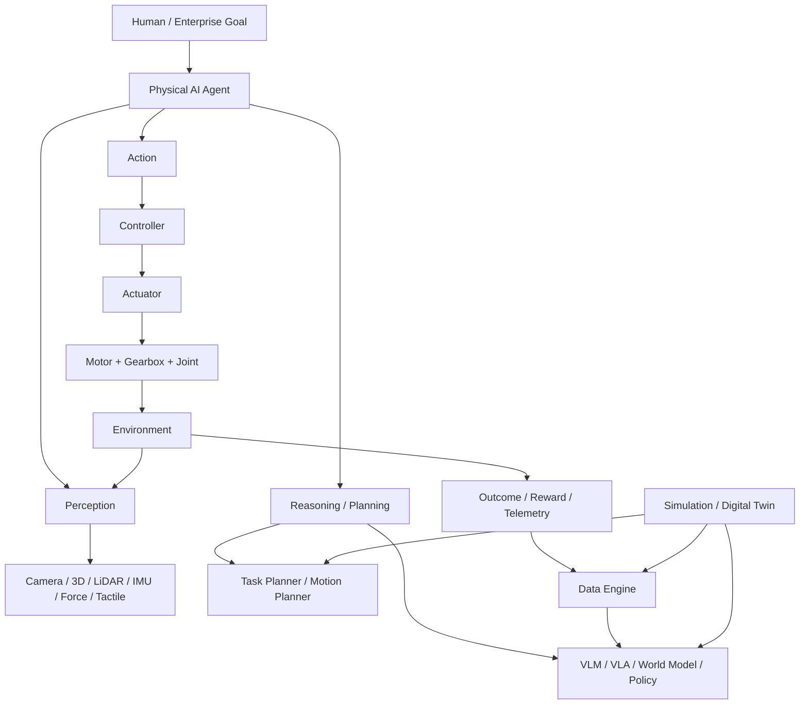

The key feedback loop is:


This closed loop is the core difference between a machine that merely executes instructions and a machine that can progressively improve.

---

# 3. Market size: how big is Physical AI?

## 3.1 There is no single authoritative Physical AI market number

The strongest conclusion from the research is that quoting one “Physical AI market size” without defining the boundary is misleading.

Selected 2025–2035 market-research estimates:

| Market definition | 2025 / 2026 size | Forecast | CAGR | Notes |
|---|---:|---:|---:|---|
| Global robotics | $63.9B (2025) | $174.4B (2032) | 15.4% | 360iResearch |
| Global robotics | $27.2B (2025) | $97.3B (2032) | 20.0% | Market Glass / ResearchAndMarkets |
| Global robotics | $125.5B (2025) | $424.0B (2032) | 19.0% | Maximize Market Research; broad definition |
| Humanoid robots | $5.4B (2026) | $50.3B (2035) | 28.1% | MarketsandMarkets |
| Humanoid robots | $10.9B (2026) | $192.7B (2035) | 37.6% | Global Market Insights |
| Humanoid robots | $2.1B (2025) | $21.6B (2035) | 26.4% | Acumen Research |
| General-purpose robotics | — | ~$370B by 2040 | — | McKinsey base-case analysis |

**Interpretation:** The disagreement is itself useful. A conservative investor should build from the **installed robotics economy**; a venture investor can additionally underwrite the much larger **general-purpose labor automation** opportunity.

### Source links

- [360iResearch robotics market](https://www.360iresearch.com/library/intelligence/robotics)
- [Market Glass / ResearchAndMarkets robotics market](https://www.researchandmarkets.com/reports/5141439/robotics-global-strategic-business-report)
- [Maximize Market Research robotics market](https://www.maximizemarketresearch.com/market-report/robotics-market/213752/)
- [MarketsandMarkets humanoid robots](https://www.marketsandmarkets.com/Market-Reports/humanoid-robot-market-99567653.html)
- [Global Market Insights humanoid robots](https://www.gminsights.com/industry-analysis/humanoid-robot-market)
- [Acumen Research humanoid robots](https://www.acumenresearchandconsulting.com/humanoid-robot-market)
- [McKinsey: general-purpose robots](https://www.mckinsey.com/industries/industrials/our-insights/humanoid-robots-in-the-construction-industry-a-future-vision)

---

## 3.2 A useful central case

For strategic planning, a reasonable base case is:

```text
2025 global robotics economy      ~$55–75B
                    │
                    ▼
2030 broad robotics economy       ~$105–145B
                    │
                    ▼
2035 broader intelligent robotics  ~$180–300B+
                    │
                    ▼
2040 general-purpose robotics     ~$370B base case
                    │
                    ▼
Long-term labor substitution      Multi-trillion-dollar economic value
```

The first three lines are **scenario ranges**, not a single published forecast. The 2040 figure is anchored by McKinsey's general-purpose robotics analysis.

---

# 4. The installed base is already enormous

The future does not start from zero.

The IFR reported:

- **542,000 industrial robots installed globally in 2024**.
- **4.664 million industrial robots operating worldwide in 2024**.
- annual installations have exceeded 500,000 for four consecutive years.
- Asia accounted for **74%** of new deployments in 2024.
- China accounted for **54%** of global installations, or about **295,000 units**.
- China exceeded **2 million** operational industrial robots.
- professional service-robot sales reached almost **200,000 units** in 2024.
- medical robots approached **16,700 units**.
- the professional Robot-as-a-Service fleet grew **31%** to more than **24,500 units**.

Sources: [IFR World Robotics 2025](https://ifr.org/worldrobotics/report-2025), [IFR service robots](https://ifr.org/news/service-robots-see-global-growth-boom/1st-quarterly-newsletter-2009).

### Industrial robot installations

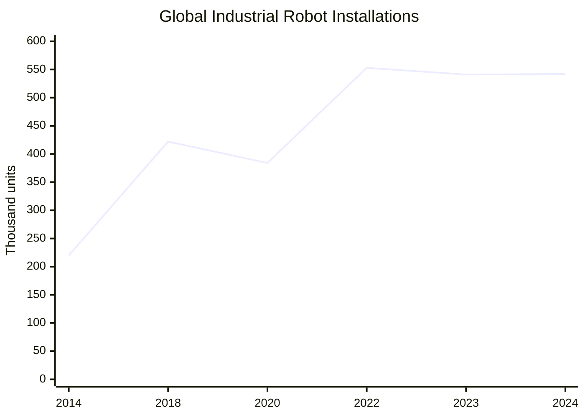

> Historical values shown for context; 2024 is the latest IFR value used here. Minor differences can occur across IFR releases and rounded figures.

### Operational industrial robot stock

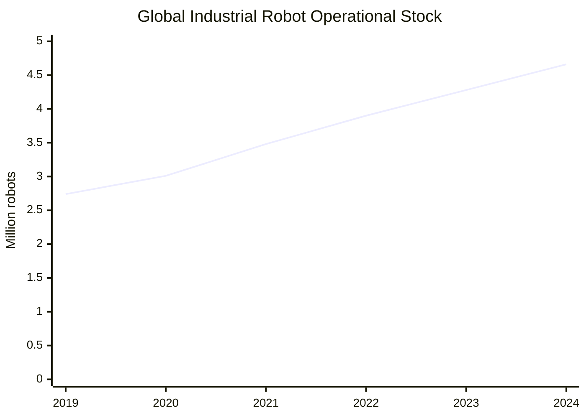

---

# 5. Geography: Physical AI is already a manufacturing power race

### Robot density, 2024

| Economy / region | Robots per 10,000 manufacturing workers |
|---|---:|
| South Korea | 1,220 |
| Singapore | 818 |
| Germany | 449 |
| Japan | 446 |
| United States | 307 |
| China | 166 in one IFR density comparison; ~567 in the updated manufacturing-employment series |
| Western Europe | 267 |
| North America | 204 |
| Asia | 131 |
| Global average | 177 |

The precise China number varies with the labor denominator used in the IFR release, which is why it should not be mixed mechanically across tables.

Source: [IFR robot density 2026 release](https://ifr.org/ifr-press-releases/news/robot-density-surges-in-europe-asia-and-americas).

### Robot density gap

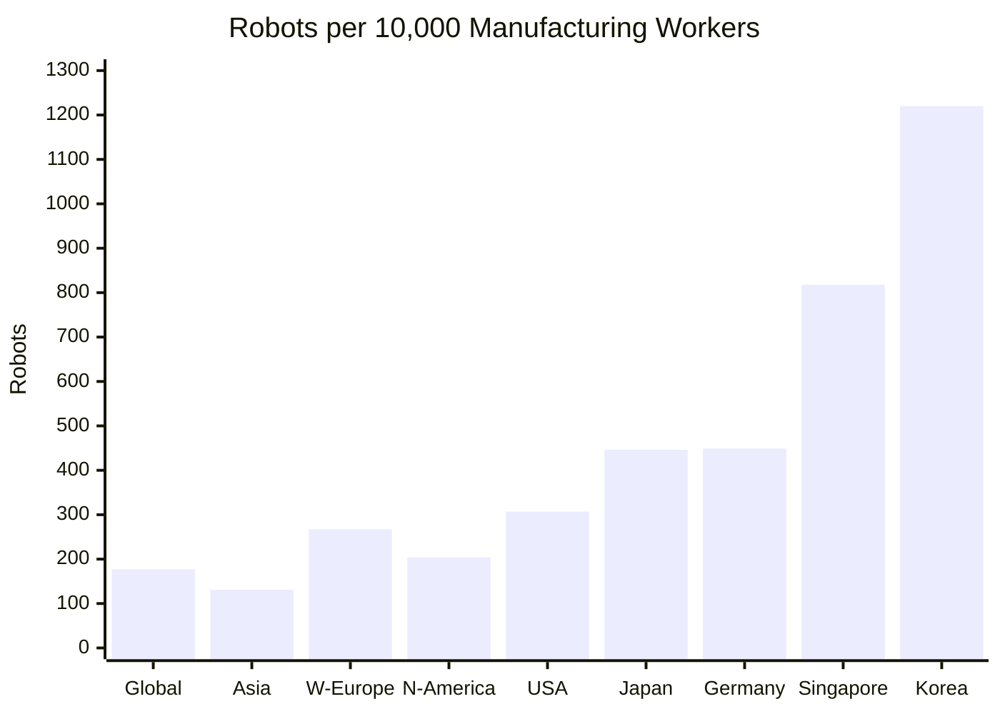

This matters because the global installed base can plausibly grow even without humanoids becoming dominant. Humanoids are an **additional adaptation layer**, not a prerequisite for robotics growth.

---

# 6. Venture capital: the Physical AI capital cycle has accelerated sharply

Crunchbase reported that robotics startups raised about **$15B during 2025** and had already raised **$18.8B in 2026 by June 22**, exceeding the full-year 2025 total while more than six months remained in the year.

Source: [Crunchbase, June 2026](https://news.crunchbase.com/robotics/startup-venture-funding-surges-2026-data/).

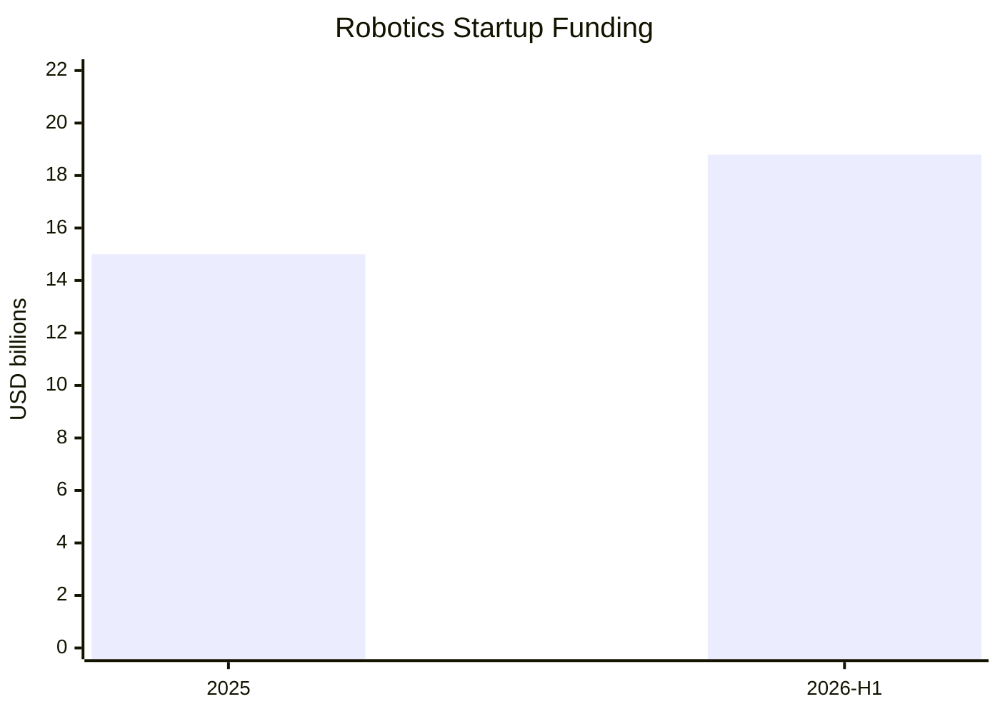

**Important:** 2026 is a year-to-date figure as of 22 June, not a full-year number.

### Why investors changed their mind

Traditional robotics had three properties that made venture capital unattractive:

1. high hardware development costs
2. low gross margins during early production
3. long deployment cycles

Physical AI changes the expected value proposition because AI can potentially be sold across many embodiments and customers, while the robot becomes the deployment surface for the model.

That produces a new flywheel:

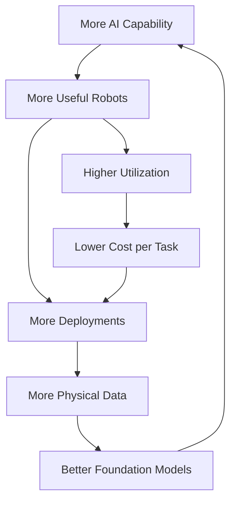

---

# 7. Sector map: where the value pools sit

## 7.1 End-market map

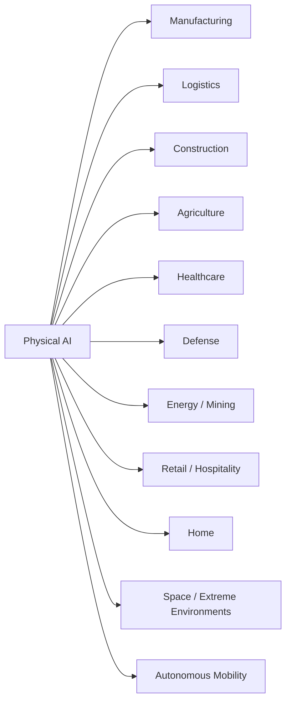

## 7.2 Technology-value-pool map

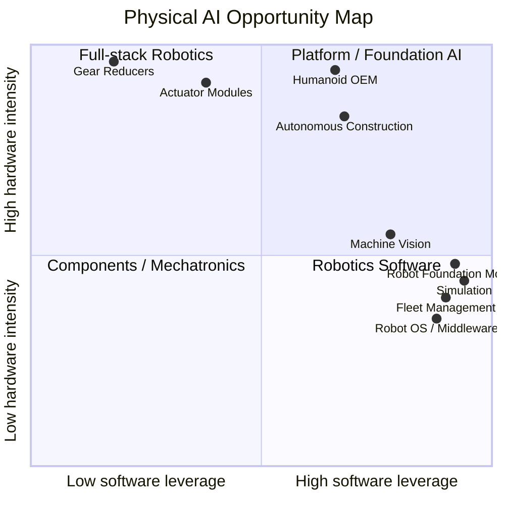

The most attractive startup opportunities often sit where **high technical differentiation meets a fragmented supply chain**.

---

# 8. Sub-sector deep dive

## 8.1 Robot foundation models / Physical AI software

### Core technologies

- Vision-Language-Action (VLA) models
- multimodal world models
- behavior cloning / imitation learning
- reinforcement learning
- diffusion policies
- hierarchical planners
- model-predictive control
- motion planning
- skill libraries
- teleoperation data engines
- synthetic data
- simulation-to-real transfer
- robot fleet learning
- safety layers
- uncertainty estimation

### Leading model/platform players

| Player | Core position |
|---|---|
| NVIDIA Isaac / GR00T | Foundation models + simulation + edge compute + robotics platform |
| Google DeepMind Gemini Robotics | VLA + embodied reasoning + on-device robotics |
| Meta V-JEPA | World-model / physical prediction research |
| Physical Intelligence | General-purpose robot foundation models |
| Skild AI | Omni-bodied/general robot foundation model |
| FieldAI | Risk-aware physical AI for industrial autonomy |
| Generalist AI | General intelligence for the physical world |
| Covariant | Robotics foundation models for warehouse manipulation |
| Shield AI | Autonomy platform, especially defense robotics |
| Intrinsic | Robot software / industrial intelligence platform |

### Research milestones

Google DeepMind introduced Gemini Robotics in 2025 and later Gemini Robotics 1.5; in July 2026 it introduced Gemini Robotics 2 for whole-body intelligence. NVIDIA released GR00T N1 as an open-weight humanoid foundation model. Meta's V-JEPA 2 demonstrated zero-shot robot planning with only tens of hours of robot data after large-scale video pretraining.

Sources:

- [Google DeepMind Gemini Robotics](https://deepmind.google/blog/gemini-robotics-brings-ai-into-the-physical-world/)
- [Google DeepMind Gemini Robotics 2](https://deepmind.google/blog/gemini-robotics-2-brings-whole-body-intelligence-to-robots/)
- [NVIDIA GR00T N1](https://research.nvidia.com/publication/2025-03_nvidia-isaac-gr00t-n1-open-foundation-model-humanoid-robots)
- [Meta V-JEPA 2](https://ai.meta.com/blog/v-jepa-2-world-model-benchmarks/)

### Key software-market benchmark

The global Robot Operating System market is estimated around **$0.72B in 2025** and **$2.27B by 2034**, around **13.5% CAGR** in one recent estimate.

Source: [Fortune Business Insights, July 2026](https://www.fortunebusinessinsights.com/robot-operating-system-market-106504).

This is small relative to the hardware market, which is precisely why software remains interesting: a successful abstraction layer can capture a larger percentage of customer value than its direct market size would suggest.

---

## 8.2 Humanoid robots

### Why humanoids matter

The core proposition is not “humans look like robots.” It is:

> **A human-shaped machine can operate in infrastructure already designed around human reach, stairs, tools, bins, doors, workstations and vehicles.**

The strongest early applications are therefore likely to be places where changing the environment is expensive.

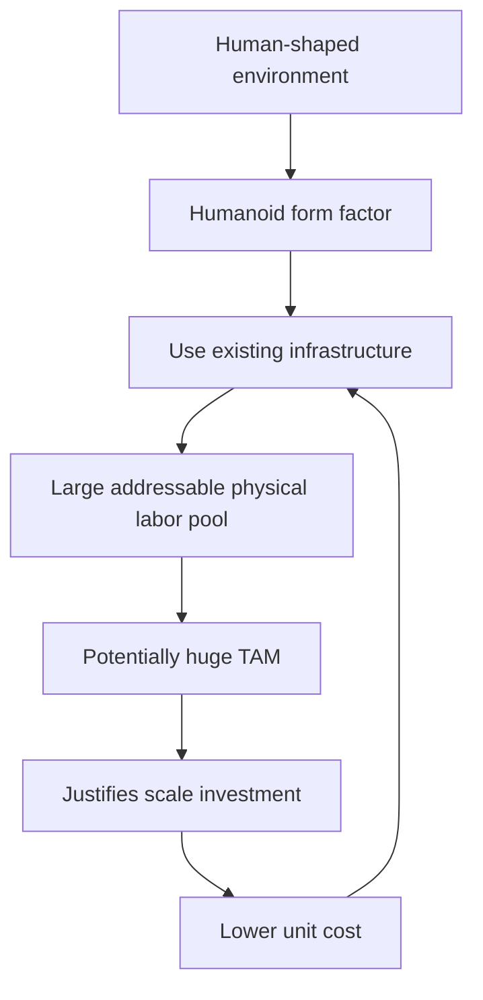

### Current major players

- Figure AI
- Tesla Optimus
- Apptronik Apollo
- Agility Digit
- Boston Dynamics Atlas
- 1X NEO / EVE
- Unitree
- UBTECH
- Agibot
- Galbot
- Fourier Intelligence
- Rainbow Robotics
- Neura Robotics
- Sanctuary AI
- LimX Dynamics
- Astribot
- EngineAI
- MagicLab
- Xiaomi Robotics

### Humanoid market forecasts are extremely dispersed

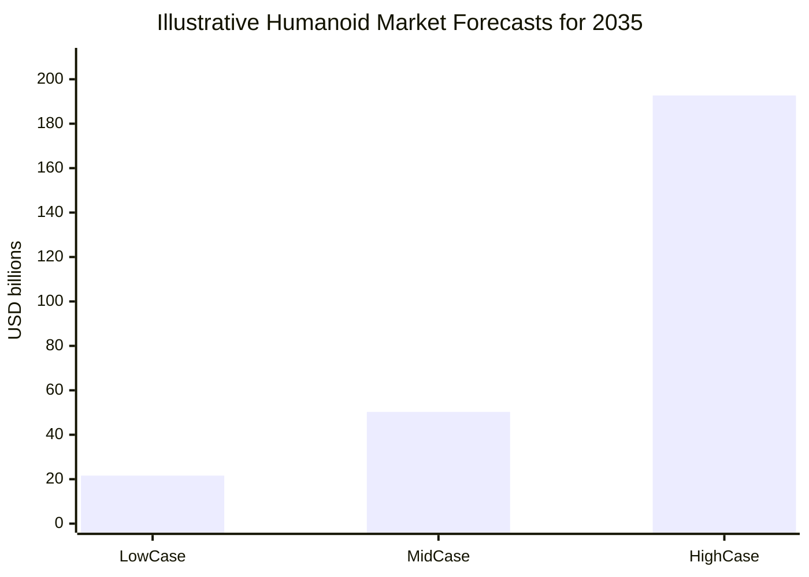

This is a reminder that **the forecast is dominated by assumptions about general-purpose capability and inclusion criteria**, not merely unit growth.

---

## 8.3 Industrial robots and cobots

This is the least speculative major Physical AI category.

The installed base is already >4.6M robots, and global annual installations exceeded 542k in 2024.

Key incumbents:

- FANUC
- ABB
- Yaskawa
- KUKA
- Kawasaki
- Mitsubishi Electric
- DENSO
- Epson Robots
- Stäubli
- Universal Robots
- Omron
- Nachi-Fujikoshi
- Comau
- Hyundai Robotics

### The next upgrade cycle

Traditional industrial robots are exceptionally good when:</n

```text
Task is repetitive
+ Environment is structured
+ Objects are known
+ Sequence is predictable
+ Failure modes are limited
```

Physical AI adds value when one or more of these assumptions fail.

The likely evolutionary path is:


---

## 8.4 Logistics / warehouse robotics

Warehouse automation is one of the most compelling near-term areas because:

- labor is expensive
- work is highly measurable
- environments are more structured than homes
- tasks are repetitive but increasingly variable
- ROI can be calculated from throughput, uptime and labor hours

In the first half of 2026, nearly **18,000 robots worth ~$1.2B** were ordered in North America, implying an average order value of roughly **$66,700 per robot** across the reported population. Warehouse wages in the same reporting were approximately **$26.85/hour**.

Source: [Wall Street Journal, August 2026](https://www.wsj.com/logistics-report/why-warehouses-are-rolling-in-more-robots-09dc27e7).

### Simple labor-equivalent calculation

At $26.85/hour:

```text
$26.85 × 2,000 hours/year = $53,700 gross hourly labor/year
```

Ignoring benefits, supervision, overtime, turnover, taxes, recruiting and productivity differences, a $50k robot could theoretically equal one gross-wage year in under one year.

But this is **not an ROI claim**. Real economics require:

```text
Robot cost
+ integration
+ maintenance
+ charging
+ downtime
+ safety infrastructure
+ software
+ depreciation
------------------------------------------------
Productive hours actually delivered
```

This is why uptime is as important as unit price.

Major players:

- Amazon Robotics
- Symbotic
- Geek+ 
- Exotec
- Locus Robotics
- Dexterity
- Ocado Technology
- Mujin
- GreyOrange
- Covariant
- Formic
- Bright Machines
- Agility Robotics
- Figure

---

# 9. Motors, actuators and gearboxes: probably the most underappreciated Physical AI market

McKinsey's 2025 humanoid supply-chain analysis is unusually important because it quantifies the stack.

### Humanoid BOM, indicative

| Subsystem | Approx. BOM share |
|---|---:|
| Actuation | **40–60%** |
| Sensing + compute | **10–20%** |
| Mechanical structure | **10–15%** |
| Power system | **5–10%** |
| Wiring / connectors / controls | **5–10%** |

Source: [McKinsey](https://www.mckinsey.com/industries/industrials/our-insights/humanoid-robots-crossing-the-chasm-from-concept-to-commercial-reality).

This immediately changes the opportunity map.

### Humanoid actuator stack

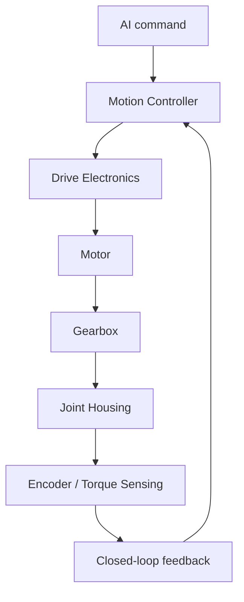

McKinsey estimates the gearbox may represent roughly **30–50% of actuator cost**.

### Why actuators are a strategic choke point

A humanoid can have dozens of powered joints. Tesla's architecture cited in McKinsey's 2026 supply-chain analysis has **28 body actuators plus 50 additional actuators in its Gen-3 hands**.

The design problem is simultaneously:

- high torque density
- low weight
- high efficiency
- high bandwidth
- backdrivability
- low backlash
- high cycle life
- thermal management
- quiet operation
- manufacturability
- low cost

No other component combines so many constraints.

### Major players

| Category | Major players |
|---|---|
| Precision reducers | Nabtesco, Harmonic Drive Systems, Sumitomo |
| Servo motors | Yaskawa, FANUC, Mitsubishi, Nidec, maxon, Kollmorgen, Moog |
| Bearings | NSK, SKF, Schaeffler, THK |
| Linear actuators / screws | THK, HIWIN, NSK, Bosch Rexroth |
| Integrated actuator startups | Apptronik, Neura, Agility, Tesla, Figure, Schaeffler, various Chinese suppliers |
| Force/torque sensing | ATI Industrial Automation, Robotiq, Bota Systems, OnRobot |

Nabtesco itself estimates approximately **60% of the global market for precision reduction gears used in medium- and large-size industrial robot joints**.

Source: [Nabtesco](https://www.nabtesco.com/en/products/robot/).

### Derived opportunity

Suppose the 2035 humanoid market reaches the MarketsandMarkets estimate of **$50.3B**.

Using the McKinsey 40–60% actuator BOM range:

```text
Humanoid market       = $50.3B
Actuation share       = 40–60%
Actuation pool        = ~$20.1B–$30.2B
```

If gearboxes represent 30–50% of actuator cost:

```text
Implied gearbox pool ≈ $6.0B–$15.1B
```

This is a **derived scenario**, not a published market-size figure.

---

# 10. Sensors and perception

Physical AI needs a much richer sensor stack than traditional automation.

### Sensor classes

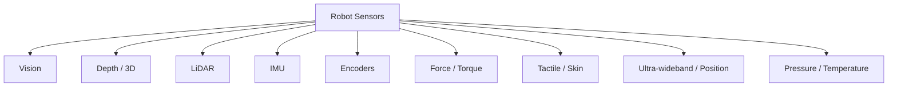

### Machine vision market

One 2025 estimate puts the global machine-vision market at **$15.83B in 2025**, rising to **$23.63B by 2030** at an 8.3% CAGR.

The narrower robotic-vision market is estimated at **$3.29B in 2025** to **$4.99B in 2030**.

Sources:

- [MarketsandMarkets machine vision](https://www.marketsandmarkets.com/Market-Reports/industrial-machine-vision-market-234246734.html)
- [MarketsandMarkets robotic vision](https://www.marketsandmarkets.com/Market-Reports/robotic-vision-market-196002505.html)

### LiDAR

The overall LiDAR market is estimated at **$3.27B in 2025** and **$12.79B by 2030**, with a 31.3% CAGR in one MarketsandMarkets forecast. Robotics is only a subset of that total.

Source: [MarketsandMarkets LiDAR](https://www.marketsandmarkets.com/Market-Reports/lidar-market-1261.html).

### Opportunity

The biggest sensor opportunity is not necessarily selling another camera.

It is **sensor fusion**:

```text
Camera + Depth + Force + IMU + Encoder + Tactile
                    │
                    ▼
             Unified State Estimate
                    │
                    ▼
              Physical World Model
                    │
                    ▼
                 Action
```

---

# 11. Compute and robotics chips

Physical AI creates a new compute hierarchy:

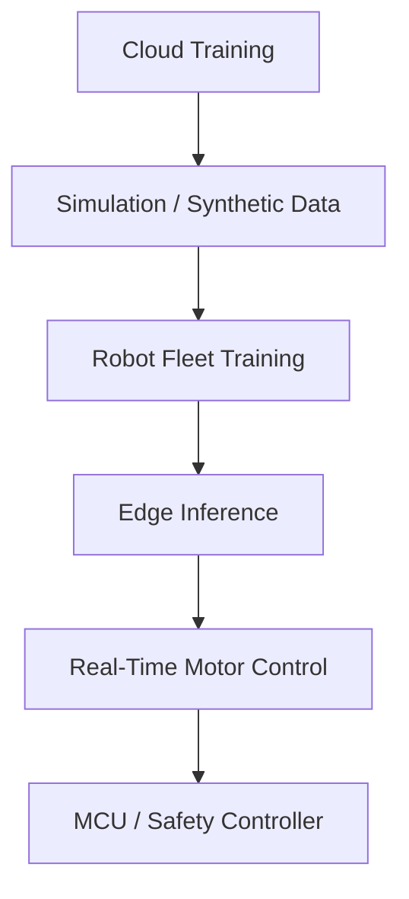

### Major compute players

| Layer | Players |
|---|---|
| Training GPUs | NVIDIA, AMD, Google TPU, Meta custom silicon |
| Robotics edge compute | NVIDIA Jetson, Qualcomm Robotics, AMD embedded, Intel, NXP |
| Vision processors | Ambarella, Hailo, Mobileye, Sony, various ISP vendors |
| Microcontrollers | NXP, STM, Renesas, TI, Infineon |
| Networking | NVIDIA, Broadcom, Marvell, NXP, EtherCAT ecosystem |
| AI software | NVIDIA Isaac, CUDA, TensorRT, ROS ecosystem, vendor SDKs |

NVIDIA is particularly important because it is attempting to own **simulation + foundation models + training + deployment compute + middleware** rather than merely the inference chip.

---

# 12. Battery and power systems

Battery performance is a hard physical constraint.

McKinsey's assessment is stark: many current humanoids run only **2–4 hours per charge**, versus **8–12 hours** for an industrial shift.

Source: [McKinsey humanoid robotics](https://www.mckinsey.com/industries/industrials/our-insights/humanoid-robots-crossing-the-chasm-from-concept-to-commercial-reality).

### Uptime gap

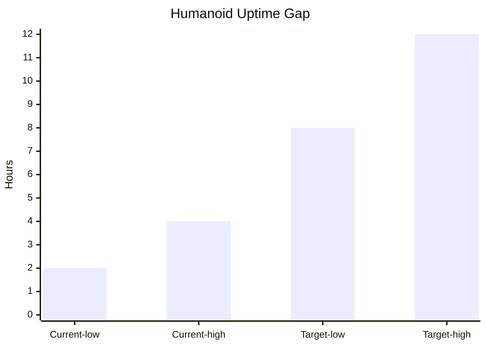

A robot that costs less but works only half a shift can have worse economics than a more expensive robot with substantially higher utilization.

### Power stack

- battery cells
- pack design
- BMS
- DC/DC converters
- inverters
- motor drivers
- charging infrastructure
- thermal management
- energy-recovery systems

Players include CATL, BYD, Panasonic Energy, LG Energy Solution, Samsung SDI, Tesla, and numerous specialist BMS/power-electronics companies.

---

# 13. Manufacturing: the hidden bottleneck

A Physical AI company can build an impressive prototype without possessing a scalable factory.

The manufacturing transition is:


The critical transition is **design-for-manufacturing + design-for-service + automated test**.

### Important manufacturing players / models

- Tesla: vertical integration + large-scale manufacturing
- Figure / BotQ: dedicated humanoid manufacturing infrastructure
- Agility Robotics: dedicated Digit production
- Apptronik: scaling Apollo production
- UBTECH / Chinese humanoid ecosystem: high-volume Chinese electronics/mechatronics supply chain
- Foxconn: electronics / robotics manufacturing ecosystem
- Jabil: contract manufacturing
- Flex: industrial electronics / manufacturing
- Bright Machines: software-defined manufacturing
- Machina Labs: robotic sheet-metal forming / advanced manufacturing
- Hadrian: automated precision manufacturing
- Symbotic: highly integrated warehouse systems

---

# 14. Advanced manufacturing as a Physical AI opportunity

Physical AI is not only about robots working in factories. It can also make factories themselves autonomous.

### Example value chain

```text
CAD
 ↓
Generative Design
 ↓
Manufacturing Planning
 ↓
Robot Simulation
 ↓
Autonomous CNC / Forming / Welding
 ↓
Vision Inspection
 ↓
Digital Twin
 ↓
Predictive Maintenance
 ↓
Closed-loop Process Optimization
```

### Machina Labs

Machina Labs raised **$124M Series C in February 2026** to scale its robotic manufacturing platform and intelligent factory infrastructure.

Source: [Machina Labs](https://machinalabs.ai/resources/machina-labs-raises-124-million-to-scale-manufacturing-infrastructure-for-defense-and-advanced-mobility).

This is strategically important because it demonstrates a category adjacent to robot OEMs: **software-defined physical production infrastructure**.

---

# 15. Software infrastructure beyond the foundation model

The Physical AI software stack is much larger than “the AI brain.”

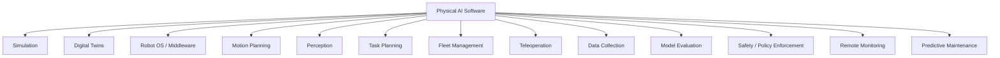

## Attractive software properties

The most valuable Physical AI software companies may share five characteristics:

1. **Embodiment agnostic** — works across many robot brands.
2. **Data network effects** — every deployed robot improves the platform.
3. **High switching costs** — fleet software becomes part of operations.
4. **Real-time capability** — not just offline analytics.
5. **Hardware optionality** — software is not trapped in one OEM.

---

# 16. Simulation and digital twins

Simulation is becoming an infrastructure layer for Physical AI because real-world training is expensive and slow.

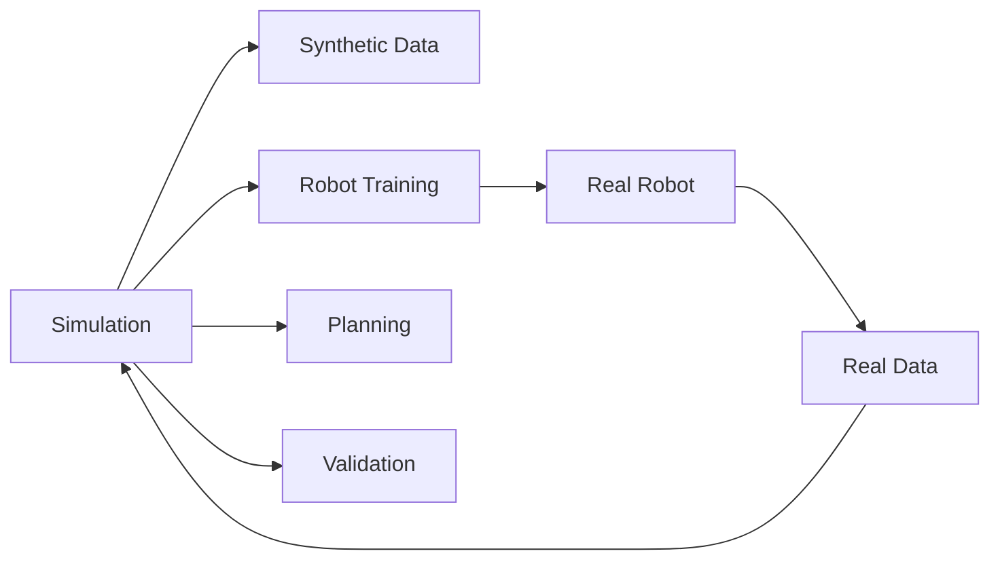

The central economic promise is:

> **One simulated hour can replace or accelerate many expensive physical hours.**

Meta's V-JEPA 2 is illustrative: it reported pretraining on over **1 million hours of internet video**, then used less than **62 hours of unlabeled robot video** for a specific robot-planning stage.

Source: [Meta research](https://ai.meta.com/research/publications/v-jepa-2-self-supervised-video-models-enable-understanding-prediction-and-planning/).

This does not imply that 62 hours is sufficient to train a general humanoid. It illustrates the strategic value of **learning reusable physical priors from large non-robot datasets**.

---

# 17. Data is the new robotics oil — but it is harder to collect

### Digital AI data vs physical AI data

| Attribute | Digital AI | Physical AI |
|---|---|---|
| Copy cost | Almost zero | High |
| Parallelization | Huge | Limited by hardware |
| Failure cost | Usually low | Potentially physical damage |
| Feedback speed | Milliseconds to seconds | Physical cycle time |
| Labeling | Often automated | Often requires demonstrations / telemetry |
| Environment diversity | Internet-scale | Hard to cover |
| Safety constraint | Moderate | Extreme |

This creates a new class of companies:

> **Physical-data infrastructure companies**

Examples include:

- teleoperation providers
- synthetic-data platforms
- demonstration-data marketplaces
- robot fleet-learning platforms
- simulation companies
- evaluation and safety platforms

---

# 18. Startup and company landscape

## 18.1 Frontier Physical AI companies

| Company | Founded | What it is | Recent / disclosed capital | Starting story | Bootstrapped / founding capital |
|---|---:|---|---:|---|---|
| Figure AI | 2022 | General-purpose humanoids + Helix + BotQ | **>$1B Series C**, $39B post-money (2025) | Founded by Brett Adcock, following his earlier software/autonomous-vehicle startup experience, to pursue general-purpose humanoids | No material bootstrapping publicly disclosed; first major external financing quickly followed incorporation |
| Apptronik | 2016 | Apollo humanoid | **>$935M Series A**, nearly $1B total by Feb. 2026 | Spun out of UT Austin Human Centered Robotics Lab; worked on NASA Valkyrie | University/research-origin; early non-venture capital not fully disclosed |
| Agility Robotics | 2015 | Digit humanoid | $400M-class Series C reported; SPAC transaction expected to raise **>$620M** | Spun out of Oregon State University's Dynamic Robotics Lab | Research/grant origin; early capital not fully disclosed |
| 1X | 2014 | NEO home humanoid + EVE | **$123.5M** in disclosed 2023–2024 rounds | Began as Halodi Robotics, focused on human-compatible general-purpose robots and tendon-like actuation | Early angel capital; exact founding amount undisclosed |
| Skild AI | 2023 | General-purpose robot foundation model | **$1.4B Series C**, valuation >$14B (Jan. 2026) | Founded by CMU robotics professors Deepak Pathak and Abhinav Gupta | No public bootstrap amount; $300M Series A was the first major public financing |
| Physical Intelligence | 2024 | General robot foundation models / π0 family | **$470M public seed + Series A** initially; later databases report further financing | Founded by senior robot-learning researchers and tech operators | Public seed was $70M; no meaningful bootstrapping disclosed |
| FieldAI | 2020s | Risk-aware Physical AI for industrial robots | **$405M** in two rounds (2025) | Built autonomy for difficult real industrial environments | No public bootstrap figure |
| Generalist AI | 2024 | Foundation models for physical AGI | **$400M** round at $2B valuation; >$500M total (2026) | Team from Google DeepMind / OpenAI / Boston Dynamics research lineage | Early inception capital undisclosed |
| Walden Robotics | 2026 | Full-stack general-purpose robots | **$300M seed** at $1.1B valuation | Launched directly from stealth with senior robotics talent | No bootstrap amount disclosed |
| Gecko Robotics | 2013 | Robotic inspection + infrastructure AI | **$347M** total; latest $125M Series D (2025) | Founder Jake Loosararian built a wall-climbing inspection robot after seeing a power-plant safety problem | YC W16; founding capital not separately disclosed |
| Dexterity | 2017 | AI robotics for logistics | **$291M** disclosed | Focused on robotic manipulation and warehouse logistics | No public bootstrap figure |
| Machina Labs | 2019 | Robotic advanced manufacturing | **$124M Series C** (2026) | Started around robotic metal forming and digitally driven manufacturing | No public bootstrap figure |
| RobCo | 2020 | Modular autonomous industrial robotics | **$100M Series C** (2026); prior funding >$60M by 2024 | Founded by TUM robotics researchers frustrated with rigid traditional automation | No bootstrap figure disclosed |
| Formic | 2020 | Robotics-as-a-Service | **$53.9M Series A** | Built around making automation affordable to small/mid-sized manufacturers | No public bootstrap figure |
| Bright Machines | 2018 | Software-defined manufacturing | **$179M launch financing**; later rounds | Built software/hardware infrastructure for automated factories | Venture-backed from early stage |
| Unitree | 2016 | Low-cost quadrupeds + humanoids | Multiple disclosed rounds; expected 2026 IPO raise ~$900M | Founder Wang Xingxing developed quadruped robots during his master's study, then founded company using angel investment | **Angel-funded from inception**; exact founding amount not publicly disclosed |
| Rainbow Robotics | 2011 | Advanced robot / humanoid platform | Samsung invested KRW **86.8B** for 14.7% and planned 35% control | Founded by KAIST Humanoid Robot Research Center researchers behind Hubo | Research-origin company |

### Primary references for company histories and financing

- [Figure AI Series C](https://www.figure.ai/news/series-c)
- [Figure Reuters](https://www.reuters.com/business/figure-valued-39-billion-latest-funding-round-2025-09-16/)
- [Apptronik Series A](https://apptronik.com/news-collection/apptronik-raises-350-million-in-series-a-funding)
- [Apptronik $935M Series A](https://apptronik.com/news-collection/apptronik-closes-over-935-million-series-a)
- [Agility company history](https://www.agilityrobotics.com/company)
- [Agility SPAC disclosure](https://www.sec.gov/Archives/edgar/data/2074973/000121390026071290/ea029548401ex99-1.htm)
- [1X company history](https://www.1x.tech/about)
- [1X 2023 funding](https://www.1x.tech/discover/1x-rasies-23-5m-in-series-a2-funding-led-by-open-ai)
- [Skild Series A](https://www.skild.ai/blogs/announcing-our-300m-series-a)
- [Skild Series C](https://www.skild.ai/blogs/series-c)
- [Physical Intelligence / Sequoia](https://sequoiacap.com/companies/physical-intelligence/)
- [Physical Intelligence Reuters](https://www.reuters.com/technology/artificial-intelligence/robot-ai-startup-physical-intelligence-raises-400-mln-from-bezos-openai-2024-11-04/)
- [FieldAI](https://www.fieldai.com/news/fieldai-announces-over-400m-in-funds-raised-to-advance-embodied-ai-at-scale)
- [Generalist](https://generalistai.com/blog/accelerating-the-next-phase-of-physical-ai)
- [Walden Robotics](https://www.waldenrobotics.com/news/walden-robotics-launches-from-stealth)
- [Gecko founding story](https://www.geckorobotics.com/about-us)
- [Gecko funding](https://www.owler.com/company/geckorobotics/funding)
- [Dexterity funding](https://www.owler.com/company/dexterity2/funding)
- [Machina Labs](https://machinalabs.ai/resources/machina-labs-raises-124-million-to-scale-manufacturing-infrastructure-for-defense-and-advanced-mobility)
- [RobCo history](https://www.rob.co/en-us/resources/news/press/robco-series-c)
- [Formic history](https://formic.co/resources/articles/saman-farid-the-co-founder-story)
- [Unitree company history](https://unitree-robot.com/about/index.html)
- [Rainbow Robotics / Samsung](https://news.samsung.com/ca/samsung-electronics-to-become-largest-shareholder-in-rainbow-robotics-accelerating-future-robot-development)

---

# 19. Funding trajectories of notable Physical AI startups

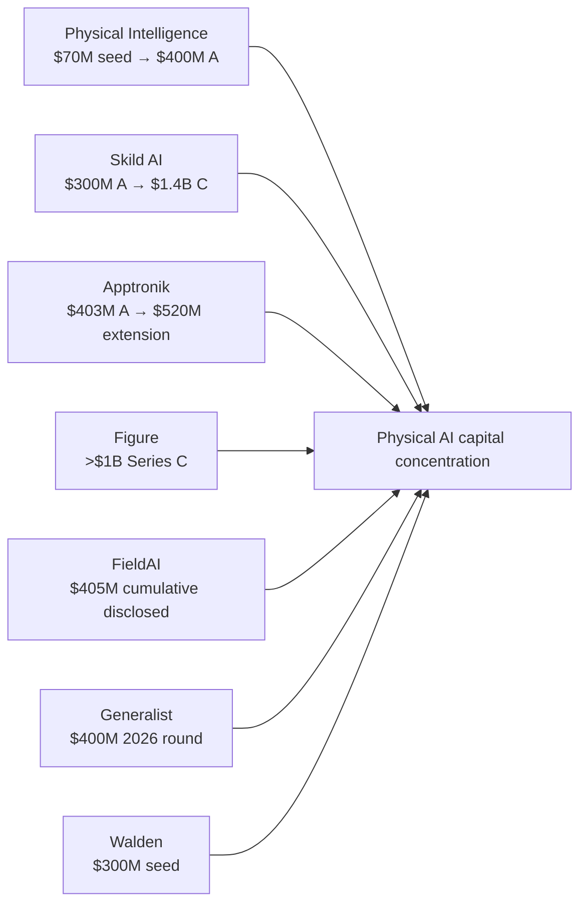

The remarkable feature is not simply the dollar amount. It is the **stage compression**.

Several startups reached hundreds of millions or billions of dollars of capital very shortly after founding because investors increasingly treat robot intelligence as an extension of frontier AI.

That creates a danger as well as an opportunity: **capital availability can outrun manufacturing readiness and field evidence.**

---

# 20. Founding stories: recurring patterns

Across the sector, five startup archetypes repeat.

### Archetype A — University robotics lab → company

Examples:

- Agility Robotics ← Oregon State
- Apptronik ← UT Austin
- Skild AI ← Carnegie Mellon
- RobCo ← Technical University of Munich
- Rainbow Robotics ← KAIST

### Archetype B — AI researchers → physical world

Examples:

- Physical Intelligence
- Generalist AI
- Skild AI
- FieldAI

### Archetype C — Robotics component breakthrough → robot company

Examples:

- 1X / Halodi: high torque-to-weight actuation
- Schaeffler / Neura: integrated actuator expertise
- Unitree: low-cost motors and compact quadrupeds

### Archetype D — Existing industrial pain → specialized autonomy

Examples:

- Gecko: infrastructure inspection
- Dexterity: warehouse manipulation
- Bedrock Robotics: autonomous construction machinery
- Machina Labs: advanced metal forming

### Archetype E — Manufacturing platform → Physical AI

Examples:

- Bright Machines
- Hadrian
- Tesla's manufacturing stack
- Figure BotQ

These archetypes suggest there is no single path to creating a Physical AI unicorn.

---

# 21. The most important quantitative challenges

## Challenge 1 — Robot cost

Current humanoid prototypes can cost roughly **$150k–$500k**. McKinsey argues that broad labor competition likely requires approximately **$20k–$50k** units.

That implies a required cost reduction of approximately:

```text
$150k → $50k  = 3× reduction
$500k → $20k  = 25× reduction
```

Source: [McKinsey](https://www.mckinsey.com/industries/industrials/our-insights/humanoid-robots-crossing-the-chasm-from-concept-to-commercial-reality).

---

## Challenge 2 — Actuation dominates the BOM

Actuation represents approximately **40–60% of humanoid BOM**.

At $50k target robot cost:

```text
Actuation cost ≈ $20k–$30k per robot
```

At 1M robots/year:

```text
Actuation value ≈ $20B–$30B/year
```

That is an enormous implied component industry if mass deployment occurs.

---

## Challenge 3 — Runtime

Current 2–4 hour operation vs 8–12 hour shifts means the robot has a **50–83% raw runtime deficit depending on the comparison point**.

Example:

```text
4 h / 8 h = 50% shift coverage
2 h / 12 h = 16.7% shift coverage
```

This is a utilization problem, not just a battery problem.

---

## Challenge 4 — Dexterity

Humans have roughly **20–27 degrees of freedom in the hand**. Many current robotic hands have materially fewer independently controllable dimensions.

The result is a nonlinear challenge:

```text
More DoF
   ↓
More actuators
   ↓
More sensors
   ↓
More compute
   ↓
More control complexity
   ↓
More failure modes
   ↓
Higher cost
```

Source: [McKinsey](https://www.mckinsey.com/industries/industrials/our-insights/humanoid-robots-crossing-the-chasm-from-concept-to-commercial-reality).

---

## Challenge 5 — Safety

Unlike a digital AI model, a bad physical action can:

- crush a hand
- damage equipment
- drop inventory
- injure a worker
- create fire risk
- create regulatory liability

Safety therefore needs to become a **system architecture**, not a checkbox.

```mermaid
flowchart TD
    A[AI Policy] --> B[Safety Governor]
    B --> C[Motion Constraints]
    B --> D[Force Limits]
    B --> E[Collision Avoidance]
    B --> F[Emergency Stop]
    B --> G[Human Detection]
    B --> H[Cybersecurity]
    C --> I[Actuation]
    D --> I
    E --> I
```

---

## Challenge 6 — Supply-chain concentration

China maintains extremely high concentration in several rare-earth supply-chain stages. The IMF reported that in heavy rare earths, China held roughly **98% of mining, 97% of oxide separation, 95% of metal refining and 90% of permanent-magnet production**.

Source: [IMF World Economic Outlook, April 2026](https://www.elibrary.imf.org/abstract/book/9798229042758/CH001.xml).

Physical AI is unusually dependent on:

- permanent magnets
- precision gears
- high-grade bearings
- semiconductors
- copper
- specialty alloys
- batteries

This creates geopolitical and supply-chain risk far beyond conventional software.

---

## Challenge 7 — Manufacturing scale

Current humanoid suppliers often cannot justify dedicated component factories because industry volume is still low. This creates a classic chicken-and-egg problem:

```mermaid
flowchart LR
    A[Low robot volumes] --> B[Low supplier investment]
    B --> C[High component cost]
    C --> D[High robot price]
    D --> E[Low customer demand]
    E --> A
```

Breaking this loop is one of the largest potential sources of value creation.

---

## Challenge 8 — Integration cost

McKinsey notes that historically transformation projects could spend roughly **$5 on safety systems and infrastructure for every $1 spent on the robot itself**.

Source: [McKinsey robotics perspective](https://www.mckinsey.com/industries/industrials/our-insights/the-age-of-thinking-machines-perspectives-on-the-future-of-robotics).

This means the true competitor to a Physical AI startup is often not another robot.

It is:

> **the cost of changing the customer's workflow.**

---

## Challenge 9 — Data scarcity

Real-world robotic trajectories are expensive compared with internet text and video.

This creates a powerful advantage for companies able to combine:

```text
Internet video
+ Simulation
+ Demonstrations
+ Teleoperation
+ Fleet data
+ Self-supervised learning
```

The company that owns the data flywheel may eventually own more value than the robot hardware manufacturer.

---

## Challenge 10 — Slow ROI validation

A demo can be spectacular while a production system is economically mediocre.

The required metric is not:

> “Can the robot do it once?”

It is:

> “Can the robot do it repeatedly, safely, with predictable uptime, at a cost lower than the alternative?”

---

# 22. Opportunity map: where the biggest businesses could emerge

## Opportunity 1 — Integrated actuator modules

Potentially one of the best component markets because actuation is 40–60% of humanoid BOM and current supply is fragmented.

A winning product would integrate:

```text
Motor
+ Gearbox
+ Encoder
+ Torque sensing
+ Driver
+ Thermal path
+ Controller
+ Mechanical interface
= Standardized smart joint
```

### Why this can become a platform

If the same actuator is sold into:

- humanoids
- cobots
- quadrupeds
- exoskeletons
- warehouse robots
- industrial arms
- prosthetics

then it becomes an industry standard rather than a single-OEM component.

---

# 23. Opportunity 2 — Robotics “system-on-joint” chips

The semiconductor analogue of the actuator problem is to collapse multiple components into a single high-integration module.

```text
Current
CPU → Driver → Sensor → Motor → Gearbox → Wiring

Future
        ┌─────────────────────────┐
        │ SYSTEM-ON-JOINT         │
        │ MCU/AI + Driver +       │
        │ Encoder + Safety + I/O  │
        └────────────┬────────────┘
                     ↓
                  Motor
                     ↓
                  Gearbox
```

This could reduce:

- wiring
- assembly labor
- calibration
- failure points
- weight
- latency
- BOM cost

---

# 24. Opportunity 3 — Robot-native operating system

A credible “Android moment” could arise if one software layer becomes the abstraction between robot hardware and applications.

```mermaid
flowchart TD
    A[Robot Application] --> B[Robot OS / Runtime]
    B --> C[Hardware Abstraction]
    C --> D[Actuators]
    C --> E[Sensors]
    C --> F[Compute]
    B --> G[Simulation]
    B --> H[Fleet]
    B --> I[Cloud]
    B --> J[AI Models]
```

The business model could include:

- software licenses
- per-robot fees
- per-hour fees
- fleet subscriptions
- simulation credits
- model inference
- premium safety features
- data analytics

---

# 25. Opportunity 4 — Physical AI data networks

The killer application may be a company that is effectively an **AWS for physical data**.

Imagine a platform that:

1. records teleoperator trajectories
2. cleans them
3. converts them into standardized robot episodes
4. generates simulation replicas
5. trains foundation policies
6. deploys them to fleets
7. collects failure cases
8. automatically retrains

```mermaid
flowchart LR
    T[Teleoperation] --> D[Data Platform]
    R[Real Robots] --> D
    S[Simulation] --> D
    D --> M[Model Training]
    M --> P[Policy Deployment]
    P --> R
    R --> F[Failure / Reward Data]
    F --> D
```

This is arguably the **highest software-leverage opportunity** in the sector.

---

# 26. Opportunity 5 — Robotics-as-a-Service

Traditional automation requires:

```text
Capex
+ Integration
+ Hiring specialists
+ Maintenance
+ Upgrade risk
```

RaaS converts it to:

```text
Monthly fee
or
$/productive hour
```

Formic is a notable example, offering automation with no upfront customer capital under its RaaS model.

IFR reported that the global professional RaaS fleet grew **31% to >24,500 units in 2024**.

This is strategically important because it can make robotics accessible to the long tail of small and mid-sized manufacturers.

---

# 27. Opportunity 6 — Autonomous construction equipment

Construction is a fascinating Physical AI market because the machine already exists.

Instead of building a humanoid first, an autonomy company can transform:

```text
Excavator
Bulldozer
Forklift
Crane
Paver
Drill
Truck
```

into a Physical AI agent.

Bedrock Robotics is an example of this strategy: AI autonomy software is being developed for existing excavators and then expanded to other construction machinery.

This strategy has one huge advantage:

> **the expensive mechanical platform already exists.**

---

# 28. Opportunity 7 — Inspection robots

Inspection is one of the strongest verticals because the economic value of information can be extremely high.

Examples:

- pipelines
- power plants
- refineries
- bridges
- aircraft
- nuclear facilities
- ports
- mines
- industrial tanks

Gecko Robotics provides a compelling model: robot + sensing + AI + asset-health software.

The important insight is that the business is not “selling a robot.”

The actual product is:

> **lower probability of catastrophic asset failure + better maintenance scheduling.**

---

# 29. Opportunity 8 — Industrial humanoids before household humanoids

A useful deployment ladder is:

```mermaid
flowchart TD
    A[Industrial] --> B[Warehouse]
    B --> C[Retail / Hospitality]
    C --> D[Healthcare / Assisted Living]
    D --> E[Home]
```

The further right you move, the harder the environment becomes:

| Environment | Predictability | Safety complexity | Willingness to pay |
|---|---|---|---|
| Factory | High | Moderate | High |
| Warehouse | Medium-high | Moderate | High |
| Retail | Medium | High | Medium-high |
| Hospital | Low-medium | Very high | High |
| Home | Very low | Extreme | Highly fragmented |

The home is likely the **largest long-term market but the hardest near-term market**.

---

# 30. Unit economics: when does a robot beat a worker?

The correct model is:

```text
Robot TCO/year
= depreciation
+ maintenance
+ software
+ electricity
+ charging
+ downtime
+ integration amortization
+ supervision
```

Human TCO/year should include:

```text
wages
+ benefits
+ overtime
+ payroll taxes
+ recruiting
+ training
+ turnover
+ absenteeism
+ workplace injuries
```

### Payback formula

```text
Payback Period
= Incremental Robot Investment
  -----------------------------------------------
  Annual Net Operating Savings
```

### Example scenario

Assume:

- robot purchase price: $50,000
- deployment/integration: $15,000
- total upfront cost: $65,000
- gross labor-equivalent value: $53,700/year
- operating/maintenance/software: $15,000/year

Then:

```text
Net annual benefit ≈ $53,700 - $15,000
                   ≈ $38,700

Simple payback ≈ $65,000 / $38,700
                ≈ 1.68 years
```

Again, this is an illustrative model, not an observed industry ROI.

The decisive variable is **productive utilization**.

At 50% utilization, the economics may become poor.

At 85–95% productive utilization, a robot can become extremely attractive.

---

# 31. Why humanoids could become a multi-trillion-dollar economic platform

Humanoid TAM should not be estimated only from current robot sales.

The more useful equation is:

```text
Addressable labor hours
× wage-equivalent value
× fraction automatable
× robot economic share
```

### Illustrative long-term scenario

Suppose:

```text
100B physical labor hours/year
× $20/hour economic value
= $2T labor value
```

If only 10% becomes economically addressable:

```text
$2T × 10% = $200B annual labor value
```

If robots capture 50% of that value as revenue:

```text
$200B × 50% = $100B annual robot / software / service revenue
```

The numbers above are **scenario assumptions**, deliberately conservative enough to illustrate the mechanism rather than a forecast.

This is why a $50B humanoid hardware market can coexist with a much larger Physical AI economic opportunity.

---

# 32. General-purpose robotics vs specialized robotics

A common misconception is that humanoids must beat every specialized robot.

They do not.

The real competition is:

```mermaid
flowchart TD
    A[Physical Task]
    A --> B{Environment Structured?}
    B -->|Yes| C[Specialized Automation]
    B -->|No| D{High Task Volume?}
    D -->|Yes| E[Adaptive Specialized Robot]
    D -->|No| F[General-Purpose Robot]
```

### The likely equilibrium

The future is likely to contain **both**:

- huge fleets of specialized industrial machines
- adaptive robots
- general-purpose humanoids
- autonomous mobile machines
- drones
- software agents coordinating them

Humanoids will win where **flexibility is more valuable than optimization**.

---

# 33. Defense and extreme environments

Physical AI is especially valuable when human presence is expensive or dangerous.

Categories:

- autonomous drones
- unmanned surface vessels
- unmanned underwater vehicles
- bomb disposal
- logistics
- battlefield resupply
- reconnaissance
- infrastructure inspection
- nuclear facilities
- space operations

The defense market has a strong advantage for early Physical AI because the economic value of replacing a dangerous mission can be extremely high.

However, defense robotics must be modeled separately from commercial labor automation because procurement cycles, regulation and mission reliability are fundamentally different.

---

# 34. Healthcare and eldercare

Long-term, eldercare may be one of the largest markets because the economic constraint is not just wages; it is the availability of human caregivers.

Potential tasks:

- lifting
- transfer assistance
- room logistics
- supply delivery
- medication transport
- cleaning
- monitoring
- mobility assistance
- social interaction

The major barrier is safety and trust, not hardware alone.

---

# 35. Agriculture

Agriculture is attractive because:

- labor is seasonal
- task locations are unstructured
- labor shortages can be severe
- yield loss has direct monetary value
- outdoor autonomy can run for long periods

Likely early markets:

- harvesting
- weeding
- spraying
- crop inspection
- orchard picking
- autonomous tractors
- vineyard robotics
- greenhouse automation

The key challenge is that agricultural environments are much harder for perception than factories.

---

# 36. Construction

Construction has almost ideal economic characteristics for Physical AI:

- expensive labor
- dangerous work
- equipment already exists
- variable environments
- measurable productivity

The strongest architecture may therefore be:

```text
Existing machine
      ↓
Autonomy kit
      ↓
Perception
      ↓
World model
      ↓
Task planner
      ↓
Autonomous operation
```

rather than building a completely new robot.

---

# 37. Competition map

## Foundation-model layer

- NVIDIA
- Google DeepMind
- Meta
- Physical Intelligence
- Skild AI
- FieldAI
- Generalist AI
- Covariant

## Humanoid OEMs

- Figure
- Tesla
- Apptronik
- Agility
- Boston Dynamics
- 1X
- Unitree
- UBTECH
- Agibot
- Galbot
- Fourier
- Neura
- Sanctuary AI
- Rainbow Robotics
- LimX Dynamics
- Astribot

## Industrial robot incumbents

- FANUC
- ABB
- Yaskawa
- KUKA
- Mitsubishi Electric
- Omron
- Kawasaki
- DENSO
- Stäubli
- Universal Robots

## Warehouse / logistics

- Amazon Robotics
- Symbotic
- Geek+
- Exotec
- Locus Robotics
- Dexterity
- Ocado
- Mujin
- GreyOrange

## Sensors / vision

- Cognex
- Keyence
- Basler
- Sony
- RealSense
- Orbbec
- Hesai
- Ouster
- SICK
- ATI Industrial Automation

## Motion / mechanical

- Nabtesco
- Harmonic Drive
- Sumitomo
- Nidec
- maxon
- Kollmorgen
- Moog
- Schaeffler
- SKF
- NSK
- THK
- HIWIN

## Manufacturing infrastructure

- Tesla
- Foxconn
- Jabil
- Flex
- Bright Machines
- Machina Labs
- Hadrian

---

# 38. Incumbents vs startups

The most important competitive question is whether Physical AI becomes:

### Scenario A — AI layer on top of old robotics

```text
FANUC / ABB / Yaskawa hardware
              ↑
       AI software layer
              ↑
        Foundation model
```

### Scenario B — vertically integrated Physical AI OEMs

```text
Foundation model
      ↓
Robot OS
      ↓
Compute
      ↓
Actuator
      ↓
Robot
      ↓
Manufacturing
```

### Scenario C — platform unbundling

The eventual industry may look like Android:

```text
Multiple robot bodies
        ↓
Common AI/runtime layer
        ↓
Application ecosystem
```

This is likely the highest software-multiple outcome.

---

# 39. The China factor

China has several advantages:

- largest industrial robot deployment base
- large manufacturing workforce
- dense electronics ecosystem
- large-scale motor and mechanical manufacturing
- strong battery supply chain
- large domestic robotics market
- state-supported industrial policy
- rapidly growing humanoid ecosystem

IFR reported that China accounted for **54% of industrial robot installations in 2024** and had over **2 million robots operating in manufacturing**.

Unitree is an especially interesting example because it originated from low-cost quadruped robotics and evolved into humanoids. Its 2025 revenue was reported at about **RMB 1.7B**, with net profit around **RMB 590M**, while a roughly **$900M IPO** was scheduled for August 2026.

Source: [MarketWatch / Unitree](https://www.marketwatch.com/story/unitrees-ipo-may-be-just-the-beginning-of-an-investor-frenzy-over-humanoid-robot-stocks-8c2d39b6).

> **Date note:** As of 18 August 2026, Unitree's IPO was scheduled to begin trading on 19 August 2026, so it should be described as an imminent listing rather than an already completed public-company milestone.

---

# 40. India opportunity

India is strategically interesting because it combines:

- large manufacturing workforce
- huge services/IT talent pool
- lower-cost engineering
- expanding electronics manufacturing
- automotive capability
- large industrial market
- strong software ecosystem
- relatively low current robot density versus leading Asian economies

India installed a record roughly **9,100 industrial robots in 2024**, according to IFR.

Source: [IFR World Robotics 2025](https://ifr.org/worldrobotics/report-2025).

### India strategy should not start with “build a humanoid.”

A stronger strategy would be:

```mermaid
flowchart TD
    A[India Software Talent]
    A --> B[Robot AI / VLA]
    A --> C[Simulation]
    A --> D[Fleet Software]
    E[Indian Manufacturing] --> F[Actuators]
    E --> G[Motors]
    E --> H[Precision Machining]
    E --> I[Electronics]
    B --> J[Indian Physical AI Platform]
    C --> J
    D --> J
    F --> J
    G --> J
    H --> J
    I --> J
```

### Highest-potential India opportunities

1. robot software / autonomy
2. simulation + digital twins
3. embedded AI / edge compute
4. precision motion components
5. actuator manufacturing
6. low-cost machine vision
7. warehouse automation
8. agricultural robots
9. industrial RaaS
10. defense robotics
11. autonomous construction equipment
12. robotics contract manufacturing

### Why India could be unusually competitive

The country does not need to win every layer.

A globally competitive Physical AI company could combine:

```text
India:
software + engineering + manufacturing cost

China:
component ecosystem

Taiwan:
semiconductors

USA:
frontier AI + capital

Europe/Japan:
precision mechatronics
```

This distributed supply chain may become the global model.

---

# 41. Physical AI opportunity matrix

| Opportunity | TAM potential | Technical difficulty | Capital intensity | Software leverage | Time horizon |
|---|---|---|---|---|---|
| Robot foundation models | Very high | Very high | Very high | Extreme | 3–10y |
| Humanoid OEM | Very high | Extreme | Extreme | High | 4–15y |
| Actuator modules | High | High | High | Medium | 2–8y |
| Precision reducers | High | High | High | Low-medium | 3–10y |
| Robot OS | High | High | Medium | Extreme | 2–8y |
| Simulation | High | High | Medium | Extreme | 1–7y |
| Teleoperation data | High | High | Medium | High | 1–7y |
| Warehouse robotics | Very high | Medium-high | High | High | 1–7y |
| Construction autonomy | Very high | High | High | High | 2–10y |
| Inspection robotics | High | Medium-high | Medium | High | 1–7y |
| Agriculture robotics | Very high | High | High | Medium-high | 3–12y |
| Home robots | Extreme | Extreme | Extreme | Extreme | 7–20y |
| Robotic components | High | High | High | Low | 2–10y |
| RaaS | High | Medium | High | High | 1–7y |

---

# 42. Investment thesis: the best companies may not look like robot companies

The highest-value companies may sit in one of five categories.

## Thesis A — The NVIDIA of robotics

A full stack combining:

```text
Compute
+ Simulation
+ Models
+ Runtime
+ Developer tools
```

## Thesis B — The TSMC of robotics mechatronics

A high-volume manufacturing platform for:

- actuators
- motors
- gearboxes
- joint modules
- robot hands

## Thesis C — The Android of robotics

An embodiment-independent operating platform.

## Thesis D — The AWS of robot data

A massive platform for:

- simulation
- teleoperation
- trajectories
- validation
- data storage
- fleet learning

## Thesis E — The Foxconn of Physical AI

A contract manufacturer capable of producing robots for multiple OEMs.

---

# 43. What could go wrong?

## Risk 1 — Humanoid hype exceeds reality

The biggest risk is that humanoids become the metaverse of robotics: spectacular demos, enormous valuations, limited economic deployment.

### Counter-signal

Look for:

- paid production deployments
- contracted units
- uptime data
- cost per task
- customer retention
- service revenue
- repeat orders

Avoid evaluating companies primarily on:

- demos
- social media followers
- valuation
- number of videos

---

## Risk 2 — Specialized robots win

A $15k purpose-built robot may beat a $50k humanoid on a single task.

Physical AI wins only when the economic value of **flexibility** exceeds the efficiency advantage of specialization.

---

## Risk 3 — Data does not generalize

A model may perform well in one factory but fail after a change in:

- lighting
- floor texture
- object geometry
- tool position
- worker behavior
- payload
- camera placement

True generalization is much harder than benchmark performance.

---

## Risk 4 — Reliability ceiling

Industrial customers often care more about:

```text
99.9% reliable mediocre automation
```

than:

```text
80% reliable magical automation
```

This is why uptime is a core AI metric in Physical AI.

---

## Risk 5 — Supply-chain geopolitics

The combination of:

- rare earths
- motors
- magnets
- batteries
- AI chips
- precision gears

creates a much greater geopolitical exposure than conventional software startups face.

---

# 44. Metrics that should replace conventional AI benchmarks

A Physical AI company should be evaluated with a new KPI framework.

| KPI | Definition |
|---|---|
| Task Success Rate | Successful tasks / attempted tasks |
| Physical Uptime | Productive operating hours / available hours |
| Intervention Rate | Human interventions / task |
| MTBF | Mean time between failures |
| MTTR | Mean time to repair |
| Cost / Task | Total TCO / successful tasks |
| Learning Rate | Performance improvement per 1,000 training episodes |
| Generalization | Success on unseen environments / known environments |
| Recovery Rate | Successful recovery from errors / errors |
| Safety Incident Rate | Safety events / operating hours |
| Teleoperation Ratio | Human-controlled time / total operating time |
| Deployment Time | Days from delivery to production |
| Fleet Improvement | Performance gain from pooled fleet data |

### The killer metric

> **Autonomous productive hours per week per robot.**

It combines intelligence, reliability, battery, safety, recovery and deployment quality into a single commercial outcome.

---

# 45. A practical “Physical AI readiness” score

For comparing companies, use a 100-point score:

```text
AI capability              20
Physical capability        15
Actuation / mechanics      10
Perception                 10
Data moat                  10
Manufacturing              10
Customer deployments       10
Unit economics             10
Safety / certification      5
------------------------------
Total                     100
```

A company with a 95/100 AI benchmark but 20/100 manufacturing readiness may be less commercially valuable than a company with 75/100 AI and 85/100 deployment maturity.

---

# 46. Roadmap: 2026–2040

```mermaid
timeline
    title Physical AI Roadmap
    2024 : Robot foundation models emerge
         : Humanoid venture funding accelerates
    2025 : Figure raises >$1B
         : Apptronik raises hundreds of millions
         : NVIDIA GR00T
         : Google Gemini Robotics
         : Meta V-JEPA 2
    2026 : Robotics funding reaches new records
         : Skild raises $1.4B
         : Generalist raises $400M
         : Walden launches with $300M
         : Boston Dynamics Atlas production
         : Agility pursues public listing
         : Unitree IPO process
    2027-2030 : First large fleets of general-purpose robots
              : Major actuator standardization
              : Robot RaaS expands
              : Physical AI software becomes a distinct enterprise category
    2030-2035 : Humanoids enter more industries
              : Manufacturing scale reduces BOM
              : Robot foundation models become commodity-like infrastructure
    2035-2040 : General-purpose robots become meaningful labor substitutes
              : Multi-robot fleets coordinate as autonomous workforces
              : Physical AI becomes a general industrial platform
```

---

# 47. Scenario analysis

## Bear case

```text
AI improves but does not generalize enough.
Humanoids stay expensive.
Specialized robotics wins most workloads.
Robot autonomy remains semi-supervised.
```

Possible result:

- robotics still grows strongly
- humanoid TAM remains tens of billions
- component suppliers benefit
- robot software becomes useful but fragmented

## Base case

```text
AI models become substantially more general.
Industrial deployment accelerates.
Humanoids enter warehouses and factories.
Actuator and compute costs fall sharply.
RaaS reduces adoption friction.
```

Possible result:

- global robotics reaches well above $100B
- general-purpose robotics reaches hundreds of billions by 2040
- Physical AI software becomes a major enterprise category

## Bull case

```text
Foundation models generalize across embodiments.
Robot cost falls below $30k.
Actuation becomes standardized.
Fleet learning produces rapid capability gains.
Robots become economically viable across broad categories of labor.
```

Possible result:

- humanoids become a mass industrial platform
- Physical AI becomes a trillion-dollar-plus economic sector
- robotics becomes a dominant application layer for frontier AI
- global labor productivity changes materially

---

# 48. What would prove the bull case?

The following milestones are more meaningful than valuation headlines.

### Hardware

- <$50k production humanoid
- <$30k scalable platform
- >8h operational shift
- >90% productive uptime
- >100k-cycle actuator reliability

### AI

- robust zero-shot generalization
- rapid adaptation to unseen tasks
- low teleoperation dependence
- reliable recovery from failures

### Economics

- <2-year payback for multiple industries
- robot labor cost below comparable human cost
- RaaS contracts with strong gross margins
- repeat fleet expansions from customers

### Manufacturing

- standardized actuator interfaces
- multiple qualified suppliers
- automated calibration/test
- high-volume production >100k units/year

### Software

- one model working across multiple robot embodiments
- transferable skills across fleets
- standardized robot runtime
- developer ecosystem independent of one OEM

---

# 49. The biggest bottlenecks are also the biggest opportunities

| Bottleneck | Quantification | Opportunity created |
|---|---:|---|
| Humanoid unit cost | $150k–$500k prototypes vs $20k–$50k target | Cost-down engineering, manufacturing |
| Actuation | 40–60% BOM | Smart joints / actuators / reducers |
| Actuator gearbox | 30–50% of actuator cost | Precision gear innovation |
| Runtime | 2–4h vs 8–12h shift | Batteries, thermal, energy optimization |
| Supply chain | China ~90% permanent magnet production | New non-China component supply chains |
| Robot density | Global 177 vs Korea 1,220 | Long runway for automation |
| Integration | Historically ~$5 infrastructure per $1 robot | Software-defined deployment |
| Data | Physical data far harder to collect | Teleoperation + simulation + fleet learning |
| RaaS | Professional RaaS fleet +31% in 2024 | Robotics financing / leasing |
| Vision | $15.8B machine vision market | AI-native perception |
| LiDAR | $3.27B → $12.79B forecast | 3D autonomy |
| Robotics OS | ~$0.72B → $2.27B forecast | Middleware / platform |
| VC funding | $18.8B by June 2026 | Capital availability for infrastructure |

---

# 50. Strategic conclusion

Physical AI is best understood as the **industrialization of machine intelligence**.

The first wave of AI monetized cognition in the digital world.

The second wave is attempting to monetize cognition in:

```text
Factories
Warehouses
Construction sites
Farms
Hospitals
Homes
Roads
Ships
Mines
Power plants
Military environments
Space
```

The market will therefore not be one homogeneous “robotics” category.

It will be a stack of interlocking markets:

```mermaid
flowchart TD
    A[Physical AI] --> B[Foundation Models]
    A --> C[Robot Platforms]
    A --> D[Actuators / Motion]
    A --> E[Sensors]
    A --> F[Compute]
    A --> G[Power]
    A --> H[Manufacturing]
    A --> I[Simulation]
    A --> J[Robot OS]
    A --> K[Data]
    A --> L[Fleet Software]
    A --> M[Services / RaaS]
    A --> N[Industry Applications]
```

### The most important strategic insight

The highest-value companies are likely to be those that solve a **bottleneck shared by many robot manufacturers**.

That points particularly strongly toward:

1. **actuator and joint standardization**
2. **robotics compute and edge AI**
3. **foundation-model infrastructure**
4. **robot operating systems / runtimes**
5. **simulation and digital twins**
6. **physical data infrastructure**
7. **robot fleet learning**
8. **RaaS / robotics financing**
9. **precision manufacturing**
10. **safety and certification infrastructure**

The ultimate winner may not sell a robot at all.

It may sell the **intelligence, components, operating system, data, manufacturing infrastructure, or financing layer used by millions of robots.**

---

# 51. Source and methodology notes

## Primary / high-confidence sources used

### Robotics installed base and adoption

- [International Federation of Robotics — World Robotics 2025](https://ifr.org/worldrobotics/report-2025)
- [IFR — Global Robot Demand Doubles Over 10 Years](https://ifr.org/news/global-robot-demand-in-factories-doubles-over-10-years/1st-quarterly-newsletter-2011)
- [IFR — Service Robots See Global Growth Boom](https://ifr.org/news/service-robots-see-global-growth-boom/1st-quarterly-newsletter-2009)
- [IFR — Robot Density 2026](https://ifr.org/ifr-press-releases/news/robot-density-surges-in-europe-asia-and-americas)

### Humanoids / economics / supply chain

- [McKinsey — Humanoids: Crossing the Chasm](https://www.mckinsey.com/industries/industrials/our-insights/humanoid-robots-crossing-the-chasm-from-concept-to-commercial-reality)
- [McKinsey — Humanoid Supply Chain](https://www.mckinsey.com/industries/industrials/our-insights/turning-humanoid-supply-chain-constraints-into-billion-dollar-wins)
- [McKinsey — Robotics Perspectives](https://www.mckinsey.com/industries/industrials/our-insights/the-age-of-thinking-machines-perspectives-on-the-future-of-robotics)

### AI / Physical AI research

- [NVIDIA — GR00T N1](https://research.nvidia.com/publication/2025-03_nvidia-isaac-gr00t-n1-open-foundation-model-humanoid-robots)
- [Google DeepMind — Gemini Robotics](https://deepmind.google/blog/gemini-robotics-brings-ai-into-the-physical-world/)
- [Google DeepMind — Gemini Robotics 2](https://deepmind.google/blog/gemini-robotics-2-brings-whole-body-intelligence-to-robots/)
- [Meta — V-JEPA 2](https://ai.meta.com/blog/v-jepa-2-world-model-benchmarks/)
- [Meta research paper](https://ai.meta.com/research/publications/v-jepa-2-self-supervised-video-models-enable-understanding-prediction-and-planning/)

### Startup financing / company histories

- [Figure AI](https://www.figure.ai/news/series-c)
- [Apptronik](https://apptronik.com/news-collection/apptronik-closes-over-935-million-series-a)
- [Agility Robotics](https://www.agilityrobotics.com/company)
- [Agility SEC transaction disclosure](https://www.sec.gov/Archives/edgar/data/2074973/000121390026071290/ea029548401ex99-1.htm)
- [1X](https://www.1x.tech/about)
- [Skild AI](https://www.skild.ai/blogs/series-c)
- [Physical Intelligence](https://sequoiacap.com/companies/physical-intelligence/)
- [FieldAI](https://www.fieldai.com/news/fieldai-announces-over-400m-in-funds-raised-to-advance-embodied-ai-at-scale)
- [Generalist AI](https://generalistai.com/blog/accelerating-the-next-phase-of-physical-ai)
- [Walden Robotics](https://www.waldenrobotics.com/news/walden-robotics-launches-from-stealth)
- [Gecko Robotics](https://www.geckorobotics.com/about-us)
- [Machina Labs](https://machinalabs.ai/resources/machina-labs-raises-124-million-to-scale-manufacturing-infrastructure-for-defense-and-advanced-mobility)
- [RobCo](https://www.rob.co/en-us/resources/news/press/robco-series-c)
- [Formic](https://formic.co/resources/articles/the-next-chapter)
- [Unitree](https://unitree-robot.com/about/index.html)
- [Samsung / Rainbow Robotics](https://news.samsung.com/ca/samsung-electronics-to-become-largest-shareholder-in-rainbow-robotics-accelerating-future-robot-development)

### Components / supply chain

- [Nabtesco precision reduction gears](https://www.nabtesco.com/en/products/robot/)
- [Schaeffler humanoid robotics](https://www.schaeffler.com/en/technology-innovation/technology/humanoid-robots/)
- [ATI Industrial Automation](https://ati.novanta.com/products/force-torque-sensors/)
- [IMF — Rare Earth Supply Chains](https://www.elibrary.imf.org/abstract/book/9798229042758/CH001.xml)

### Market-size benchmarks

- [360iResearch robotics](https://www.360iresearch.com/library/intelligence/robotics)
- [ResearchAndMarkets robotics](https://www.researchandmarkets.com/reports/5141439/robotics-global-strategic-business-report)
- [Maximize Market Research robotics](https://www.maximizemarketresearch.com/market-report/robotics-market/213752/)
- [MarketsandMarkets humanoid robots](https://www.marketsandmarkets.com/Market-Reports/humanoid-robot-market-99567653.html)
- [Global Market Insights humanoid robots](https://www.gminsights.com/industry-analysis/humanoid-robot-market)
- [Acumen Research humanoid robots](https://www.acumenresearchandconsulting.com/humanoid-robot-market)
- [MarketsandMarkets machine vision](https://www.marketsandmarkets.com/Market-Reports/industrial-machine-vision-market-234246734.html)
- [MarketsandMarkets robotic vision](https://www.marketsandmarkets.com/Market-Reports/robotic-vision-market-196002505.html)
- [MarketsandMarkets LiDAR](https://www.marketsandmarkets.com/Market-Reports/lidar-market-1261.html)
- [Fortune Business Insights ROS](https://www.fortunebusinessinsights.com/robot-operating-system-market-106504)

### Capital-market / current trend sources

- [Crunchbase — Robotics funding 2026](https://news.crunchbase.com/robotics/startup-venture-funding-surges-2026-data/)
- [IEEE Robotics & Automation Society funding report](https://www.ieee-ras.org/global-robotics-industry-funding-report-2025/)

---

# 52. Data-quality and interpretation rules

This report intentionally separates three classes of numbers:

### Class A — Direct reported facts

Examples:

- IFR robot installations
- company-announced financing
- publicly reported customer orders
- published model specifications

### Class B — Third-party market estimates

Examples:

- humanoid market forecasts
- total robotics market forecasts
- software market forecasts

These should be treated as **ranges**, not ground truth.

### Class C — Derived scenario calculations

Examples:

- actuator TAM from humanoid market × BOM share
- robot payback examples
- implied gearbox market
- long-term labor-value scenarios

These are intentionally labeled as derived assumptions and should not be confused with reported market statistics.

---

# 53. One-page investor cheat sheet

```text
PHYSICAL AI — 2026 CHEAT SHEET

GLOBAL ROBOTICS
• ~542k industrial robots installed in 2024
• ~4.66M industrial robots in operation
• China ≈54% of 2024 installations
• Professional service robots ≈199k sold in 2024
• RaaS fleet >24.5k, +31%

CAPITAL
• Robotics startups ≈$15B funding in 2025
• $18.8B already raised in 2026 by Jun-22

HUMANOIDS
• Market forecasts differ wildly
• 2026 estimates ≈$5B–$11B
• 2035 estimates ≈$22B–$193B
• Prototype cost ≈$150k–$500k
• Target cost ≈$20k–$50k
• Runtime ≈2–4h today vs 8–12h shift

BOM
• Actuation ≈40–60%
• Sensing + compute ≈10–20%
• Structure ≈10–15%
• Power ≈5–10%
• Wiring / control ≈5–10%

BEST BOTTLENECKS
• Actuators
• Gearboxes
• Smart joints
• Edge AI compute
• Physical data
• Simulation
• Robot OS
• Safety
• RaaS
• Manufacturing

BEST NEAR-TERM APPLICATIONS
• Warehouses
• Factories
• Inspection
• Construction equipment
• Logistics
• Defense

BEST LONG-TERM APPLICATIONS
• Humanoids
• Healthcare
• Agriculture
• Home robotics
• General-purpose labor

CORE THESIS
The robot is the embodiment.
The model is the intelligence.
The data is the moat.
The actuator is the muscle.
The manufacturing system is the scale engine.
The software platform is the multiplier.
```

---

## Final takeaway

**Physical AI is likely to become one of the major technology-industrial platforms of the 2030s.**

But the investable opportunity is broader than humanoid robots.

The deepest value pools are likely to emerge wherever the industry is constrained by a scarce capability:

> **intelligence, actuation, sensing, compute, manufacturing, data, safety, or deployment economics.**

That is why the long-term market should be thought of less as “the humanoid industry” and more as a new **physical computing stack** spanning semiconductors, mechatronics, AI, manufacturing and labor automation.
